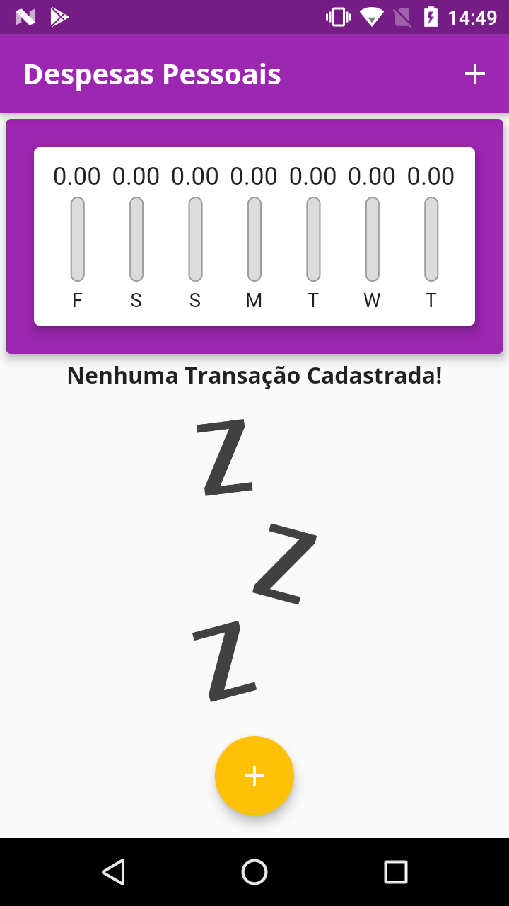
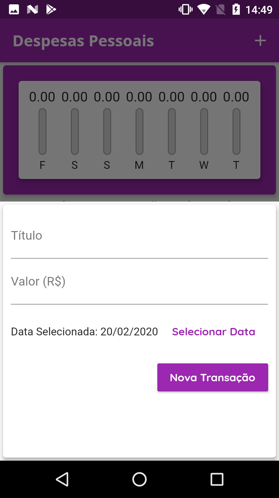
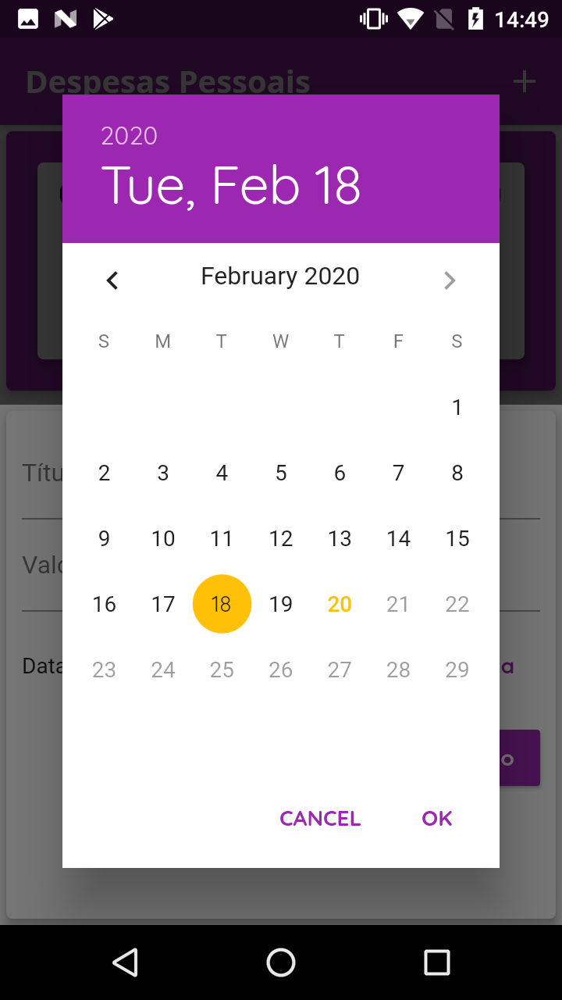
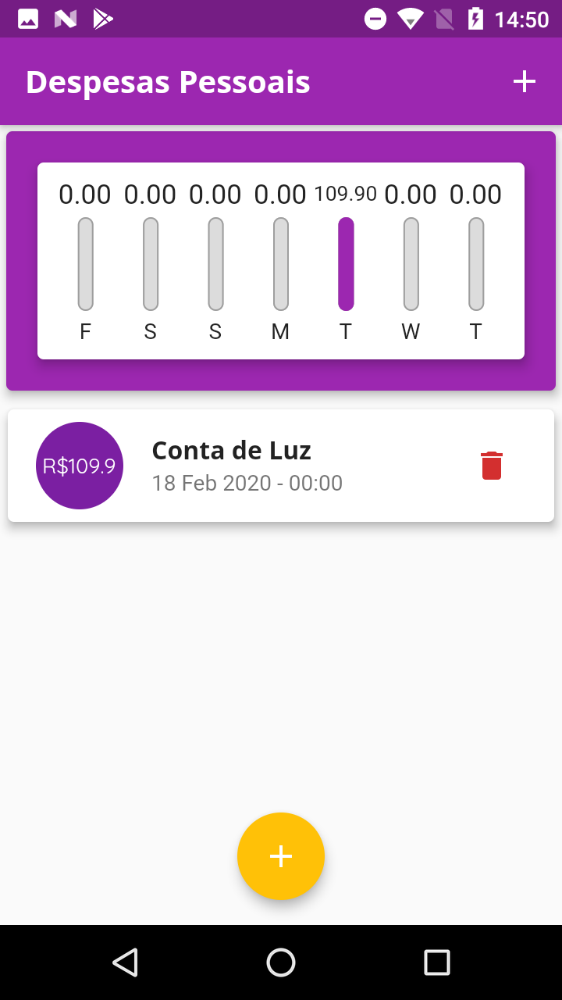
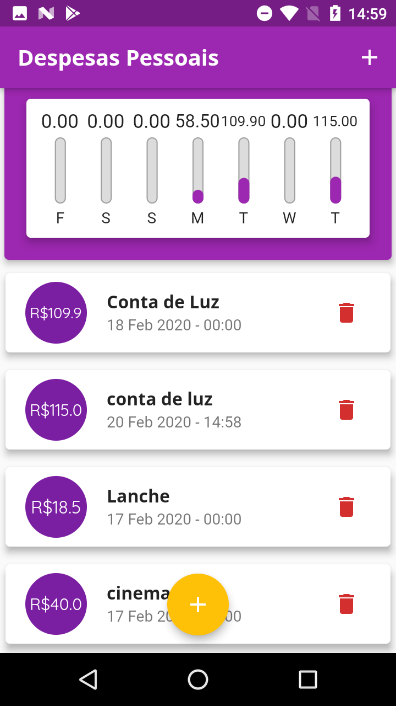

# Despesas Pessoais

App para registrar e gerenciar suas despesas pessoais.

    

Registre seus gastos do dia a dia e tenha mais controle sobre seu dinheiro usando apenas seu smartphone.

    

Selecione a data em que foi efetuada cada transação.

    

Tenha a possibilidade de excluir suas transações registradas.

    

Registre quantas transações quiser e monitore seus gastos semanais através de um gráfico.

    

